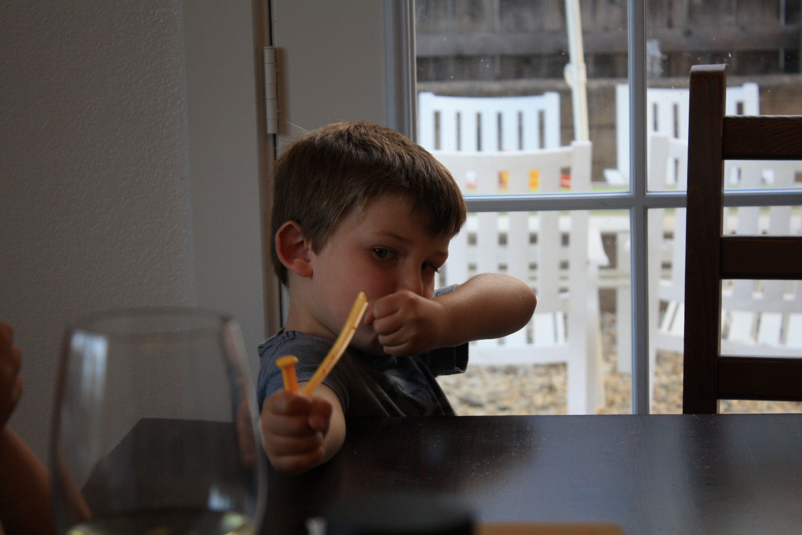

## Homework to be completed before lab this week

- Footage Challenge #1

## Tonight in Lab

### Video Challenge Review...

<iframe width="560" height="315" src="https://www.youtube.com/embed/f2picMQC-9E" frameborder="0" allow="accelerometer; autoplay; encrypted-media; gyroscope; picture-in-picture" allowfullscreen></iframe>

### Photo Editing...

Click to download:

Some tools we will be covering tonight:

- Cropping
- Auto tools (brightness/contrast/levels)
- Content aware fill
- Magic Wand
- Magic Eraser

## Due at the end of lab

- Results of our photo editing activity
- Naming convention:

`firstname-lastname-photo-editing.zip`

## Homework for next week

- Open lab next week
